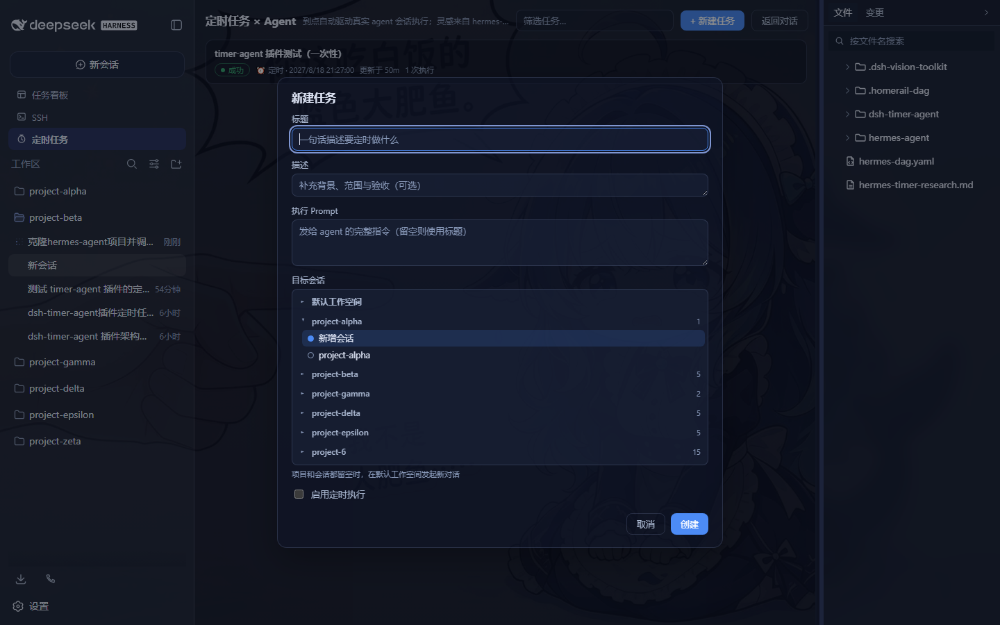

# dsh-timer-agent — DSH 定时任务 × AI Agent 引擎

[English](./README.en.md) | 中文

一个 [DeepSeek Harness (DSH)](https://github.com/) Web GUI 插件:调研 [NousResearch/hermes-agent](https://github.com/NousResearch/hermes-agent) 的 cron 系统后,按其「定时器 ↔ Agent 协同」思路实现的 **host 常驻定时任务引擎**——`dsh web` 服务启动即生效,**GUI 页面关闭也照常触发**。



## 它做什么

到点(5 段 cron)通过**真实 agent 会话**执行你写好的 prompt:

- **指定已有会话** → 每次触发继续该对话,具备上下文连续性(hermes cron 的 continuity 形态)
- **指定项目 workdir** → 每次在该项目内新建会话运行(自动加载其 AGENTS.md)
- **两者都留空** → 每次触发在默认工作空间新建会话发起新对话

对话中可直接用 `timer_agent` 工具管理任务(create / list / update / pause / resume / remove / run);Web GUI 侧边栏「定时任务」面板管理同一批任务——**一个台账,三个入口**(工具 / WebUI / 文件)。

## 架构(hermes-agent cron 同构)

```
┌─ dsh web 宿主进程 ────────────────────────────────┐
│  60s ticker(常驻,GUI 关闭也运行)                  │
│   ├─ HostJobStore   ~/.dsh/timer-agent/jobs.json  │
│   │                 (原子写,损坏降级不崩溃)        │
│   ├─ TimerRunner    at-most-once:先顺延 nextRunAt │
│   │                 再触发;运行中跳过;错过即跳过   │
│   │   ├─ agents.resume(钉住会话)                  │
│   │   └─ agents.create + workspaceRegistry        │
│   │       (新会话挂到正确项目)                     │
│   ├─ timer_agent 工具(模型可调用)                 │
│   └─ /api/dsh-timer-agent/* 路由(仅回环)          │
└────────────────────────┬──────────────────────────┘
                         │ HTTP 轮询镜像(5s)
┌─ 浏览器半边(薄)────────┴──────────────────────────┐
│  侧边栏入口 + 任务面板(React)                      │
│  可折叠项目/会话树 · cron 预设 · 执行历史           │
└───────────────────────────────────────────────────┘
```

执行结算通过 `session/event`(`turn/end` 的 `reason.kind`)判定成功/失败,失败原因精确写入台账。

## 功能

- **定时执行**:5 段 cron(分 时 日 月 周,支持 `*` / `*/n` / `a-b` / 逗号列表)+ 预设下拉(每天 09:00 / 每小时 / 每 10 分钟 / 每周一 09:00,新建与编辑页均有)
- **目标树选择器**:按项目分组的可折叠树,每组含「新增会话」+ 该项目已有会话(按最近活跃排序);选中会话即钉住该对话
- **任务面板**:列表(标题/状态/下次运行/执行次数)、搜索过滤、详情页(cron 编辑/执行历史/跳转会话 transcript/立即执行/重置/删除)
- **模型工具**:任何对话中 `timer_agent` 直接创建与管理定时任务
- **系统提示注入**:host 半边注册 `plugin:timer-agent` 播报段,agent 知晓本插件能力与协作方式
- **安全**:API 路由仅回环 + 同源可访问(与 dsh-ssh 同防线)

## 安装

```sh
dsh plugin --profile web add link:<本目录绝对路径>
```

安装后**重启 `dsh web`**,侧边栏出现「定时任务」入口即生效(浏览器侧改动强刷 `Ctrl+F5` 即可)。

## 构建

```sh
pnpm install
pnpm run build      # lib/index.js(host) + lib/client.js(浏览器,CSS 已内联)
pnpm run typecheck
pnpm run smoke-test # 23 项端到端冒烟
```

## 与 hermes-agent cron 的对应关系

| hermes-agent | 本插件 |
|---|---|
| gateway 进程内 60s ticker | `dsh web` 宿主进程内 60s ticker |
| 触发即新 AIAgent(platform=cron) 会话 | `agents.create`/`resume` 真实 dsh 会话 |
| ~/.hermes/cron/jobs.json 台账 | ~/.dsh/timer-agent/jobs.json(原子写) |
| at-most-once(先推进 next_run_at) | 先顺延 nextRunAt 再触发 |
| claim 去重 + 心跳 | 运行中跳过 + 5s 手动触发快通道 |
| deliver 回投/指定平台续跑 | 钉住会话 / workdir 新会话 / 默认空间 |
| cron_hint → notepad → script 组装 prompt | 自包含 prompt(无人在场,不可提问) |
| turn/end reason.kind=error 结算 | 同款 session/event 结算 |

## 已知限制

- 定时执行依赖 `dsh web` 服务进程存活(服务停了自然不触发;重启后只跑已顺延到期的任务,错过即跳过)
- 任务运行中到点跳过本次,等下一个 cron 匹配点
- 执行消耗 API 额度;定时执行无人在场,prompt 必须自包含、不可提问

## 致谢

- [NousResearch/hermes-agent](https://github.com/NousResearch/hermes-agent) — cron 架构范本
- [dsh-web-ui 全家桶](https://github.com/linxin666)(dsh-ssh / dsh-client-ui-task-board)— host 服务、路由注册、侧边栏注入与预设下拉的工程先例

## License

Apache-2.0
